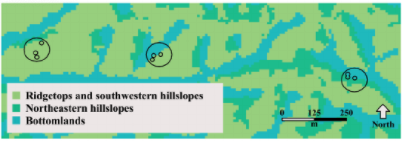

```{r setup, include=FALSE}
options(htmltools.dir.version = FALSE)
```

# Yang akan kita lakukan hari ini

.pull-left[
Diskusi prinsip dan alur analisis data menggunakan R<sup>1</sup>


]

.pull-right[
Latihan analisis data keanekaragaman burung dan vegetasi<sup>2</sup>


]

.footnote[

[1] BES. 2017. Guide to Better Science: Reproducible Code. British Ecological Society. https://www.britishecologicalsociety.org/publications/guides-to

[2] Adams and Stevens. 2019. “Diverse temperate forest bird assemblages demonstrate closer correspondence to plant species composition than vegetation structure.” Ecography. https://doi.org/10.1111/ecog.04487
]

---

# Prinsip alur analisis yang baik

- Mulai dari salinan data mentah (**data mentah tidak boleh berubah**)

--

- Seluruh pemrosesan data, baik *cleaning*, *filtering*, dsb harus melalui skrip, tidak boleh manual di dalam file data

--

- Pisah alur skrip R ke beberapa unit tematis. 
  + Contoh: bagian (1) membaca dan membersihkan data, (2) analisis data, (3) produksi tabel dan grafik

--

- Jika kamu melakukan beberapa kode lebih dari satu kali, buatlah `function`, dan dokumentasikan dengan baik apa yang dilakukan oleh kode tersebut: apa input dan outputnya, apa yang dilakukan fungsinya, dan mengapa

--

- Dokumentasikan kode dan data melalui komentar
  + menggunakan '#' dalam skrip, atau
  + dokumentasi tertulis yang terpisah

--

- Segala luaran perantara dalam alur analisis **harus dipisah dari data mentah** 

---

# Yang biasa saya lakukan

1. Menginisiasi `Project` dalam RStudio

--

1. Membuat struktur *folder* yang `Project`

--

1. Tulis `README` dalam folder `Project`

--

1. Membaca data dan mengecek bentuk data

--

1. Mengubah bentuk data sesuai tujuan analisis

--

1. Analisis data dengan eksplorasi (statistik deskriptif)

--

1. Uji statistik

---

class: inverse, center, middle

# "*Embrace a one folder = one project mentality. Rstudio's "R projects" are excellent for encouraging this. This habit enables easy communication with other scientists and for that reason it is so important.*" 
## Anonymous

---

# Membuat `R Project`

Untuk membuat R Project, klik `File` -> `New Project...` -> `New Directory`

.pull-left[

]

.pull-right[
- Tulis nama folder `Project`
- Pilih `directory` yang diinginkan kalau belum sesuai
- Klik `Create Project`.

Nanti akan muncul tampilan R Studio kosongan.
]

---

# Membuat struktur folder dalam project

1. Konsisten

--

  + Apa pun sistem penamaan yang digunakan, pastikan untuk tetap menggunakan sistem tersebut

--

1. Hierarkis

--

  + Mulai dari jenis folder paling dasar, lalu buat folder anakan sesuai keperluan.

--

1. Gunakan README untuk mendeskripsikan struktur folder

--

1. Segala data dari koleksi, entri, atau mungkin kolaborator perlu "dikarantina" dan tidak disentuh

--

1. Catat semua alur ide, diskusi, dan keputusan analisis. 
  + Buat folder `info` jika perlu untuk hal seperti ini

--

1. Pisahkan pekerjaan yang sudah selesai dan sedang berlangsung.


---

# Contoh struktur folder untuk analisis sederhana


.footnote[
[*] diambil dari Guide to Better Science: Reproducible Code. British Ecological Society
]

---
class: inverse, center, middle

# "*Never ever touch raw data. Store them permanently, and use scripts to produce derived, clean datasets for analyses.*" 
## Francisco Rodríguez-Sánchez, Estación Biológica de Doñana (CSIC)

---
# Beberapa cara menamai file di R

* ***Machine readable*** 

--

  + Hindari spasi, tanda baca, huruf beraksen. 

--

  + Gunakan penisah seperti "_" untuk memisah info file

--

* ***Human readable*** 

--

  + Pastikan nama file juga mengandung info tentang file

--

* **Mudah diurutkan**

--

  + Bisa dengan memulai dengan angka atau tanggal.
  
--

  + Kalau pakai tanggal, gunakan format YYYY-MM-DD

--

  + Untuk skrip, bisa menomori urutan penggunaan skrip. Contoh: 1_data-cleaning.R, 2_linear-model.R


---
# Contoh penamaan file yang baik dan buruk


.footnote[
[*] diambil dari Guide to Better Science: Reproducible Code. British Ecological Society
]

---

# Struktur folder dan sistem penamaan yang bagus membuat alur analisis mudah dirunut


.footnote[
[*] diambil dari Guide to Better Science: Reproducible Code. British Ecological Society
]


---

# Prinsip analisis dengan bahasa pemrograman

### 1. Gaya penulisan kode logis dan mudah dibaca

### 2. Banyak komentar dan dokumentasi di setiap tahap

### 3. Tulis kode yang jika dipindah ke komputer lain bisa langsung dijalankan tanpa masalah (*portable code*)

### 4. Buat `function` untuk beberapa tahap yang terus menerus diulangi

.footnote[
Bisa dibaca lebih banyak lagi di *Guide to Better Science: Reproducible Code*. British Ecological Society (lihat link di slide pertama)
]

---

class: inverse, center, middle

# Demo: Apakah keanekaragaman burung lebih dipengaruhi struktur atau komposisi spesies vegetasi?
### Analisis data Adams & Matthews (2019)

---

# Tentang Data

Dalam latihan ini kita akan membaca data komunitas burung dan vegetasi dari bentang alam hutan campuran di Ohio, Amerika Serikat.

Spesies burung dan vegetasi diperoleh dengan metode *point count* di 210 titik sebanyak 6 kali survei sepanjang tahun 2015-2016.

Data tersebut diambil dari tiga tipe habitat:
1. *Ridgetops and southwestern hillslopes* atau *dry-oak* (do) atau habitat kering, 96 titik
2. *Northeastern hillslopes* atau *dry-mesic* (dm) atau habitat campuran, 59 titik
3. *Bottomlands* atau *wet-mesic* (wm) atau habitat riparian, 55 titik




---

# Membaca data dan mengecek bentuk data

```{r,message=F}

# Unggah library yang diperlukan --------
library(vegan)
library(tidyverse)

# Baca data -------
bird<-read.csv("input/bta_snm_vbirds.csv")
veg<-read.csv("input/bta_snm_vallde.csv")
veg_str<-read.csv("input/bta_snm_vfield.csv")
```

--

Perhatikan bahwa di sini dicontohkan pula:
* cara memisah sub-bagian skrip dengan karakter '-'
* cara mengacu direktori anakan dalam suatu R `Project`
* cara mengomentari tahapan kode

---

# Membaca data dan mengecek bentuk data

```{r}
# Tunjukkan tiga baris pertama data
head(bird,3)
```

---

# Membaca data dan mengecek bentuk data

```{r}
# Melihat dimensi data (baris dan kolom)
dim(veg)
dim(bird)

# Tunjukkan tiga baris pertama data dan 5 kolom pertama
veg[1:3,1:5]
```

---

# Membaca data dan mengecek bentuk data

```{r}
# Tunjukkan tipe tiap variabel yang ada dalam data
str(veg_str)
```

---

# Membaca data dan mengecek bentuk data

Data struktur vegetasi (`veg_str`) berisi 6 variabel:

| Kolom | Maksud |
|-------|--------|
| X | Titik hitung vegetasi dan burung (metode *point count*) |
| all_stem_den | Jumlah batang pohon per hektar |
| big_stem_bas | Luas basal pohon (m^2/ha) dengan diameter min 8 cm pada ketinggian dada (DBH) |
| can_cover_mea | Persen tutupan kanopi |
| can_heig_mea | Rataan tinggi kanopi (m) |
| ELT | *Ecological Land Type* atau tipe habitat |

---

# Mengubah bentuk data sesuai tujuan analisis

Nama kolom perlu diubah agar lebih informatif sesuai kebutuhan.
```{r}
colnames(veg_str)<-c("site", "stemDensity", "bigStemBasalArea", "canopyCover", "canopyHeight", "landtype")
```

Tipe data karakter dalam `veg_str` juga perlu diganti menjadi faktor.
```{r}
veg_str<-veg_str %>% mutate(site=as.factor(site),
                            landtype=as.factor(landtype))
```

Cek apakah keseluruhan data sudah terganti
```{r}
str(veg_str)
```

---

# Mengubah bentuk data sesuai tujuan analisis

Beberapa fungsi dalam R membutuhkan bentuk data tertentu.

Untuk fungsi `specnumber()` yang akan digunakan, hanya boleh ada kolom spesies sementara baris menunjukkan lokasi *site*.

```{r}
# Ambil semua data bird kecuali kolom pertama & taruh ke data baru
bird2<-bird[,-1]

# Ganti nama baris data baru  dengan kolom pertama data lama
rownames(bird2)<-bird[,1]
```

Lihat bentuk data baru dan bandingkan dengan yang lama

.pull-left[
```{r}
bird2[1:3,1:3]
```
]

.pull-right[
```{r}
bird[1:3,1:3]
```
]

---

# Mengubah bentuk data sesuai tujuan analisis

Data komposisi vegetasi berstruktur sama dengan burung, dan kita ingin mengubahnya agar bisa digunakan sebagai input `specnumber()`.

Ketika set kode yang sama perlu diulangi, kita bisa membuat fungsi

.pull-left[
Kode yang ingin diulangi:
```{r}
# Ambil semua data bird kecuali 
# kolom pertama & taruh ke data baru
bird2<-bird[,-1]

# Ganti nama baris data baru dengan 
# kolom pertama data lama
rownames(bird2)<-bird[,1]
```
]

.pull-right[
Bentuk fungsi dari kode tersebut:
```{r}
ubahData<-function(x)
  {
  # Ambil semua data bird kecuali 
  # kolom pertama & taruh ke data baru
  d<-x[,-1]
  # Ganti nama baris data baru dengan 
  # kolom pertama data lama
  rownames(d)<-x[,1]
  
  # Meminta fungsi menampilkan hasil
  return(d)
}
```
]

---

# Mengubah bentuk data sesuai tujuan analisis

Dengan demikian kita memiliki fungsi `ubahData()` untuk melakukan serangkaian proses transformasi data untuk input yang berbeda.
```{r}
veg2<-ubahData(veg)
```

Dengan demikian kita punya dua data yang siap dihitung jumlah spesies per titik hitung.
```{r}
# Hitung jumlah spesies per titik hitung
birdSp<-specnumber(bird2)
vegSp<-specnumber(veg2)
```

.pull-left[
```{r}
head(birdSp)
```
]

.pull-right[
```{r}
head(vegSp)
```
]

---

# Analisis data dengan eksplorasi (statistik deskriptif)

Pertama, kita gabung dulu data jumlah spesies ke data struktur vegetasi.
```{r}
veg_str$birdRichness<-birdSp
veg_str$treeRichness<-vegSp
str(veg_str)
```

---

# Analisis data dengan eksplorasi (statistik deskriptif)

Lalu cek tren yang menjadi pertanyaan penelitian. 

Contoh: bagaimana perbedaan kepadatan pohon per hektar di jenis habitat yang berbeda?
```{r}
veg_str %>% group_by(landtype) %>% summarise(count=n(),
                                             mean=mean(stemDensity),
                                             stdev=sd(stemDensity))
```

---

# Analisis data dengan eksplorasi (statistik deskriptif)

Lebih mudah melakukan eksplorasi dengan membuat visualisasi data dengan `graphics` (`base R`, kiri) atau `ggplot2` (kanan):

.pull-left[
```{r, fig.width=3, fig.height=4}
hist(veg_str$stemDensity,
     main=NULL,
     xlab="Jumlah pohon/ha",
     ylab="Frekuensi")

```
]

.pull-right[
```{r, message=FALSE, fig.width=5, fig.height=3}
ggplot(veg_str)+
  geom_histogram(aes(x=stemDensity), bins=15)+
  labs(x="Jumlah pohon/ha", 
       y="Frekuensi")
```
]

---

# Analisis data dengan eksplorasi (statistik deskriptif)

Kita bisa mencoba melihat hubungan antara dua variabel sebagai berikut.

.pull-left[
```{r, eval=FALSE}
ggplot(veg_str)+
  geom_point(aes(x=treeRichness,
                 y=birdRichness))+
    labs(
      x = "Jumlah spesies pohon per site",
      y = "Jumlah spesies burung per site",
      title = "Species richness")+
  theme_minimal()
```
]

.pull-right[
```{r, echo=FALSE, fig.retina=10, fig.height=5}
ggplot(veg_str)+
  geom_point(aes(x=treeRichness,y=birdRichness))+
    labs(x = "Jumlah spesies pohon per site",
       y = "Jumlah spesies burung per site",
       title = "Species richness")+
  theme_minimal()
```
]

Seputar visualisasi data dengan ggplot, bisa dibaca di: https://r4ds.had.co.nz/data-visualisation.html

---

# Uji Statistik

1. Menentukan hipotesis nol dan alternatif
  + biasanya hipotesis nol adalah "*tidak ada efek*", dan alternatifnya adalah "*ada efek*"
  
--

  + perlu diperhatikan bahwa teori bisa memberikan hipotesis nol yang berbeda. Contoh: gradien hubungan keanekaragaman adalah 3/4 sehingga hipotesis nolnya adalah gradien = 3/4 dan alternatifnya adalah negasinya.

--

1. Menghitung besaran efek

--

  + perbedaan antar rataan

--

  + besar gradien hubungan antara dua variabel

--

  + perbedaan antara dua perlakuan

--

  + dll (sangat tergantung studi)

---

# Uji Statistik

1. Ubah besaran efek sehingga kita bisa membandingkannya ke suatu distribusi yang diharapkan
  + Kita ingin tahu probabilitas suatu besaran efek sama atau mungkin lebih besar dari yang kita amati, mengasumsikan hipotesis nol benar.
  
--

  + Biasanya kita tidak bisa langsung menghitung ini dari besaran efek; di sinilah transformasi matematis diperlukan untuk membuat besaran efek yang kita amati dapat dibandingkan ke suatu distribusi besaran efek (t, F, chi-square, dll.)
  
--

1. Tanyakan peluang mengamati efek sebesar atau lebih besar dari yang kita amati, mengasumsikan hipotesis nol benar (P value).
  + Batasan yang paling umum adalah 0.05
  
--

1. Pikirkan apa artinya.

---

# Uji Statistik (Uji Korelasi)

Ketika kita ingin melihat hubungan korelasi antara dua variabel, langkah 2-4 bisa kita lakukan dengan fungsi `cor.test()`:

```{r}
cor.test(veg_str$birdRichness,veg_str$treeRichness)
```

---

# Uji Statistik (Uji Korelasi)

Perhatikan bahwa untuk melakukan uji korelasi, data yang diuji harus memenuhi beberapa asumsi:

* Distribusi variabel x dan y mendekati distribusi normal

* Variansi y tetap sama sepanjang nilai x dan sebaliknya

* Hubungan antara x dan y mendekati garis lurus (bukan kurva)

.footnote[
Lebih banyak lagi tentang analisis korelasi di http://research.sbcs.qmul.ac.uk/r.knell/Intro_biostats_R/correlation-analysis.html
]
---

# Uji Statistik (Regresi linear)

Kita juga bisa melakukan regresi linear, atau memodelkan hubungan antara variabel x dan y agar mengikuti persamaan berikut:

$$
y = a + bx
$$

di mana y adalah variabel dependen, x variabel independen, a adalah konstanta yang mendefiniskan nilai y ketika x = 0, dan b adalah gradien garis hubungan antara x dan y.

Asumsi yang harus dipenuhi data:
* Independen
* Nilai *error* (perbedaan antara nilai observasi dengan nilai prediksi dari garis) mengikuti distribusi normal
* Variansi y tetap sama sepanjang nilai x dan sebaliknya (*homogeneity principle*)
* Ada hubungan linear antara variabel independen (x) dan variabel dependen (y)
* Variabel independen diukur tanpa error (umumnya hanya perlu dikawatirkan dalam studi alometri ketika ukuran bagian tubuh berkorelasi dengan ukuran tubuh keseluruhan)

.footnote[
Lebih banyak lagi tentang analisis korelasi di http://research.sbcs.qmul.ac.uk/r.knell/Intro_biostats_R/using-linear-regression-to-analyse-tb-trends-in-the-uk.html#assumptions-of-linear-regression
]

---

# Uji Statistik (Regresi linear)

Mari coba lihat hubungan jumlah spesies pohon dan burung dalam satu habitat:

```{r}
m_do<-veg_str %>% filter(landtype=="do") %>% lm(birdRichness ~ treeRichness,.)
summary(m_do)
```

Dari `summary` objek `lm()`, a = 11.46314, b = 0.23093.

---

# Uji Statistik (Regresi linear)

Untuk mengetahui apakah model linear yang kita buat memenuhi asumsi, kita dapat melihat plot diagnostik `lm()` dalam R.

.pull-left[
```{r, eval=FALSE}
par(mfrow=c(2,2))
plot(m_do)
```
]

.pull-right[
```{r, echo=FALSE, fig.height=6}
par(mfrow=c(2,2))
plot(m_do)
```
]

(dijelaskan dalam sesi)

---
# Uji Statistik (Regresi linear)

Ketika kita sudah yakin bahwa model regresi linear kita menjelaskan dengan baik hubungan antara dua variabel, kita perlu memikirkan apa artinya.

.pull-left[
```{r, eval=FALSE}
veg_str %>% 
  filter(landtype=="do") %>%
  ggplot()+
  geom_point(aes(x=treeRichness,y=birdRichness))+
    labs(x = "Jumlah spesies pohon per site",
       y = "Jumlah spesies burung per site",
       title = "Species richness")+
  geom_abline(slope=0.23093, intercept=11.46314)+
  geom_smooth(aes(x=treeRichness,y=birdRichness),method="lm")+
  geom_text(aes(x=35,y=10), label=paste("y = 12.8 + 0.19x\n"))+
  theme_minimal()
```
]

.pull-right[
```{r, echo=FALSE,message=FALSE,fig.height=4,fig.retina=10}
veg_str %>% 
  filter(landtype=="do") %>%
  ggplot()+
  geom_point(aes(x=treeRichness,y=birdRichness))+
    labs(x = "Jumlah spesies pohon per site",
       y = "Jumlah spesies burung per site",
       title = "Species richness")+
  geom_abline(slope=0.23093, intercept=11.46314)+
  geom_smooth(aes(x=treeRichness,y=birdRichness),method="lm")+
  geom_text(aes(x=35,y=10), label=paste("y = 12.8 + 0.19x\n"))+
  theme_minimal()
```
]

Misal, berapa banyak pertambahan spesies burung per pohon?

---

# Uji Statistik (Regresi linear)

Berdasarkan hasil regresi, gradien garis adalah 0.23, jadi ada 1 spesies burung setiap 0.23 spesies pohon.

Seberapa meyakinkan angka ini? Fungsi `confint()` memberikan kita 95% selang kepercayaan untuk estimasi angka a dan b.

```{r}
confint(m_do)
```

Berdasarkan angka ini kita 95% yakin bahwa gradien yang sesungguhnya ada di antara angka 0.11 dan 0.35.

---

# Uji Statistik (Regresi linear)

Berapa banyak spesies burung yang kita harapkan dari 20 hingga 25 spesies pohon misalnya?

```{r}
a=11.46314
b=0.23093
x=c(20:25)

y<-a+b*x
y
```

Hanya 16-17 spesies burung.

---

# Uji Statistik

Uji statistik "hanya" alat, kita perlu memikirkan apa artinya dan bagaimana hipotesis yang kita miliki menentukan uji statistik yang kita perlukan.

Misal, apakah cukup menggunakan jumlah spesies pohon untuk memprediksi kekayaan burung? Apakah tidak perlu variabel yang lain?

Banyak konsultasi dengan dosen pembimbing mengenai variabel yang perlu dieksplorasi dan diuji.

---

class: center, inverse, middle

# Latihan: Apakah ada hubungan antara struktur vegetasi dengan kekayaan spesies burung?

### 1. Buat R `Project` dan struktur folder untuk yang sesuai

### 2. Unduh data di https://datadryad.org/stash/dataset/doi:10.5061/dryad.k48h616 (klik '*Download dataset*'), ekstrak datanya, dan letakkan di folder input kalian sebagai data mentah

### 3. Baca data yang sesuai ke dalam R (lihat `README.txt`) dan lakukan cleaning data seperlu kalian untuk menjawab pertanyaan hubungan antara struktur vegetasi dan kekayaan spesies burung (pilih salah satu parameter struktur vegetasi)

---

class: center, middle

# Selamat mencoba!

## Slide ini dapat diakses di https://github.com/sagitaninta/hardSkillNymphaea

Slides created via the R package [**xaringan**](https://github.com/yihui/xaringan).

The chakra comes from [remark.js](https://remarkjs.com), [**knitr**](https://yihui.org/knitr/), and [R Markdown](https://rmarkdown.rstudio.com).
